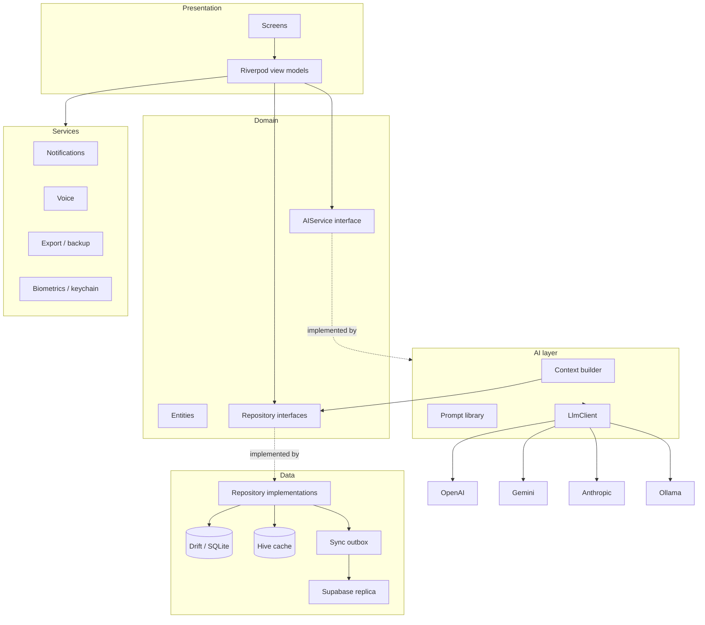
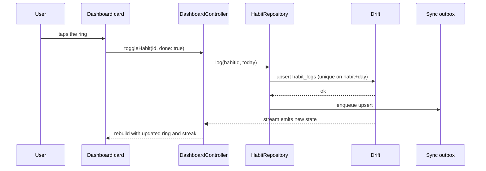

# Architecture

## The shape of it

Three rules hold the whole thing together:

1. **The domain layer imports nothing from `data/` or `features/`.** It has no
   Flutter dependency beyond `foundation`. If a change to storage forces a
   change to an entity, the layering has been violated.
2. **Reads are streams, writes return `Result`.** Every repository follows this.
   The UI binds to a stream and re-renders when the database changes, so a write
   only has to report success or failure — it never hands back the new list.
3. **Failures are values, not exceptions.** Anything a user could plausibly hit
   (offline, denied permission, bad input) travels as `Err<Failure>`. Throwing
   is reserved for programmer error.

## Why offline-first, specifically

The local SQLite file is the source of truth. The cloud is a replica of it, not
the other way round. Concretely:

- A write goes to Drift and enqueues an outbox row **in the same transaction**.
  The app can be killed mid-save without losing the intent to sync.
- The UI never awaits the network. `SyncService` drains the outbox when
  connectivity returns.
- Session restore reads from cache first, so a cold start on a plane lands
  straight on the dashboard. Remote validation happens opportunistically after.
- Cloud sync can be switched off entirely, and then nothing is even queued — no
  shadow copy accumulates for a backend the user never opted into.

### The sync trade-off, stated plainly

Sync is **last-write-wins per record**. LifeOS is single-user; the device that
wrote most recently is right. A CRDT or per-field merge would add real
complexity to solve a conflict class that barely exists here (the same person
editing the same journal entry on two devices within one sync window). The cost
is that a genuine simultaneous edit loses one side. If LifeOS ever grows shared
data, that decision has to be revisited — it is contained in `SyncService` and
`SyncQueueWriter`.

## Data flow: one write, end to end

Logging a habit from the dashboard:

Nothing in that path is manual invalidation. The Drift stream is what closes
the loop, which is why logging a habit by voice repaints the dashboard ring
without either feature knowing about the other.

### Surfaces outside the widget tree

The same principle covers the two things a Drift stream cannot repaint: the
notification schedule and the home-screen widgets. Both are derived from the
database, both live outside the app process, and both would rot if every write
path had to remember to refresh them.

`TableWatcher` (`lib/data/local/table_watcher.dart`) subscribes to Drift's
`tableUpdates` for a named set of tables and runs a rebuild once the writes
settle. `reminderSyncProvider` and `homeWidgetSyncProvider` are the two
instances; `main()` mounts them at startup and nothing else refers to them.

The consequences are worth stating, because they are the reason for the design:
a task created by voice, by the assistant, or by restoring a backup schedules
its reminder through the same path as one typed into the task screen, and a new
write path added tomorrow gets the behaviour for free. The debounce means a
burst of writes — a restore, a batch of habit ticks — rebuilds once.

## Layer responsibilities

### Domain (`lib/domain/`)
Freezed entities and repository interfaces. Entities carry the logic that is
genuinely about the concept rather than about storage or pixels: `Goal.isAtRisk`
compares elapsed time against progress; `Task.urgencyScore` blends due date with
priority; `Recurrence.occursOn` answers whether a rule fires on a date. That
logic is unit-testable without a database or a widget tree.

### Data (`lib/data/`)
Drift tables, mappers, repository implementations, the sync outbox, and the
Supabase client. Row classes carry a `Row` suffix so they never get confused
with the domain entity they map to, and all translation lives in one
`mappers.dart` — the compiler then points at exactly the two functions that need
updating when a column changes.

### Presentation (`lib/features/`)
One folder per feature, each with `application/` (view models) and
`presentation/` (screens and widgets). View models are `Notifier` /
`AsyncNotifier` classes. Screens hold no business logic; the deepest thing they
do is decide layout from a window size class.

### AI (`lib/ai/`)
The only provider-shaped abstraction in the app is `LlmClient`. Everything above
it — prompt assembly, grounding, citation resolution, lenient parsing, retries,
fallback — is written once against that interface. See
[AI_PIPELINE.md](AI_PIPELINE.md).

### Services (`lib/services/`)
Platform capabilities behind interfaces: notifications, speech, OCR, export,
encryption, biometrics, home-screen widgets, and the life-score calculator.
Each is injectable and each has a working in-memory or stub implementation, so
tests never touch a platform channel.

## Performance decisions worth knowing

- **The database runs on a background isolate** (`drift_flutter`), so a year of
  habit logs for a heatmap never blocks the UI thread.
- **The dashboard composes six independent stream providers** rather than one
  giant query, so a change in one module rebuilds only its slice.
- **`BackdropFilter` is only mounted when the theme asks for blur.** It is the
  most expensive thing on the dashboard; high-contrast mode skips it entirely
  and renders opaque cards.
- **The journal and timeline are paged**, and the timeline uses a `before`
  cursor rather than an offset — with records being written constantly, an
  offset page would silently skip or repeat items.
- **Recurring events are expanded on read**, not materialised. A "every weekday"
  event would otherwise generate thousands of rows that all have to be rewritten
  when the series is edited.
- **The search index is denormalised** into one table written inside each
  module's write transaction, turning cross-module search into a single scan
  instead of a nine-way union.

## Accessibility

Not a late pass — it shapes several of the decisions above:

- High-contrast mode is a real theme variant that removes blur and shadow, not a
  colour tweak.
- The user's text-size preference multiplies the OS setting rather than
  replacing it, and is clamped to a legible range.
- Every animation collapses to an instant build when the platform reports
  "reduce motion". Animation is decoration; it never gates content appearing.
- Direction is never carried by colour alone — deltas pair a colour with an
  arrow, heatmap cells distinguish "not scheduled" with an outline rather than
  a hue.
- Sliders carry semantic labels naming their dimension, cards expose semantic
  labels, and every icon-only control has a tooltip.
