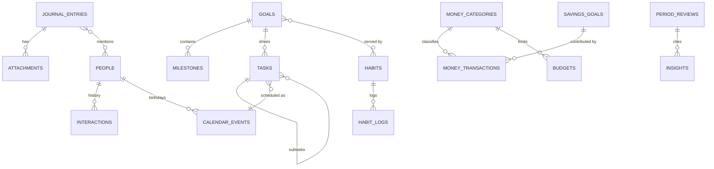

# Database schema

SQLite via Drift. Definitions live in `lib/data/local/tables.dart`; the database
and its migrations in `lib/data/local/app_database.dart`.

## Conventions

| Convention | Why |
| --- | --- |
| `id` is a client-generated UUID **v7** text primary key | Records can be created offline and merged without renumbering; v7 is time-ordered so index inserts stay sequential |
| Timestamps stored as UTC `DateTime` | Unambiguous across timezones |
| `dayKey` (`yyyy-MM-dd`) stores the **local** calendar day | "Did I journal today?" is a wall-clock question, not a UTC one |
| Money is `int` minor units | Doubles lose the last cent under summation, and budgets are exactly where that shows |
| User-visible deletes are soft (`deletedAt`) | So the deletion can propagate to other devices |
| Row classes get a `Row` suffix | Keeps them distinct from the domain entity they map to |

## Entity relationships

## Tables

### Journal
- **`journal_entries`** — `id`, `createdAt`, `updatedAt`, `dayKey`, `title`,
  `body`, `tags` (JSON), `peopleIds` (JSON), `location` (JSON `GeoPoint`),
  `weather`, `moodScore`, `analysis` (JSON `JournalAnalysis`), `isFavorite`,
  `deletedAt`.
- **`attachments`** — `id`, `entryId` → journal (cascade), `kind`, `localPath`,
  `remoteUrl`, `caption`, `transcript`, `durationMs`, `createdAt`.
  `transcript` holds speech-to-text for voice notes, which is what makes them
  searchable.

### Mood
- **`mood_entries`** — six 1–10 dimensions plus `note`, `tags`, `dayKey`, and an
  optional `journalEntryId` link.

### Habits
- **`habits`** — `cadence`, `kind` (binary/quantity), `target`, `unit`,
  `customSchedule` (JSON `Recurrence`), `reminderMinutes`, `goalId`,
  `archivedAt`.
- **`habit_logs`** — **unique on (`habitId`, `dayKey`)**. Logging twice updates
  the amount instead of creating a duplicate, which is what makes streak
  arithmetic reliable.

### Goals and tasks
- **`goals`** — `horizon`, `status`, `targetDate`, `manualProgress` (null means
  "derive from milestones"), `habitIds`, `achievedAt`.
- **`milestones`** — `goalId` (cascade), `position`, `dueDate`, `completedAt`.
- **`tasks`** — `parentId` (one level of nesting by design), `priority`,
  `status` (doubles as the Kanban column), `orderIndex`, `recurrence`,
  `estimateMinutes`, `aiReason`, `completedAt`.

### Calendar
- **`calendar_events`** — `startsAt` / `endsAt` (named that way because `END` is
  a SQL keyword), `allDay`, `kind`, `recurrence`, `reminderOffsets` (JSON int
  list), `peopleIds`, `isAiScheduled`, `deletedAt`.
  Recurring events are **expanded on read**, never materialised.

### Money
- **`money_categories`**, **`money_transactions`**, **`budgets`**,
  **`savings_goals`**. Transactions carry `receiptPath` and `receiptText`, so
  a scanned receipt is searchable by its contents.

### Health
- **`health_metrics`** — one table for every metric, discriminated by `kind`.
  Adding a metric is an enum value, not a migration.
- **`health_targets`** — per-metric overrides of the enum defaults.

### People
- **`people`** — `relation`, `details` (JSON list of things worth remembering),
  `birthday`, `followUpEveryDays`, `lastInteractionAt` (denormalised so the
  follow-up query is a single indexed scan).
- **`interactions`** — `personId` (cascade), `channel`, `summary`.

### Assistant and analytics
- **`chat_threads`**, **`chat_messages`** (with `citations` JSON).
- **`insights`** — `kind`, `confidence`, `citations`, `data` (chartable
  payload), `pinned`, `dismissed`.
- **`period_reviews`** — unique on (`period`, `periodStart`) so a period has one
  canonical review.
- **`life_scores`** — one row per day, keyed by `dayKey`.

### Infrastructure
- **`search_docs`** — denormalised index: `source`, `sourceId`, `title`, `body`
  (lower-cased haystack), `occurredAt`, `imagePath`. Written inside each
  module's write transaction, so it can never describe a row that no longer
  exists.
- **`recent_queries`** — for the search empty state.
- **`sync_queue`** — the offline outbox: `entity`, `entityId`, `operation`,
  `payload`, `attempts`, `lastError`.

## Indexes

Created in `_createIndexes()`, one per access pattern the app actually has:

| Index | Serves |
| --- | --- |
| `idx_journal_day`, `idx_journal_created` | day lookups, feed ordering |
| `idx_mood_day` | daily aggregation |
| `idx_habitlog_habit_day` | streaks and heatmaps |
| `idx_task_status`, `idx_task_due` | Kanban columns, today's list |
| `idx_event_range` | calendar range queries |
| `idx_txn_date`, `idx_txn_category` | month views, category totals |
| `idx_health_day` | daily summaries |
| `idx_chat_thread` | message history |
| `idx_search_source` | filtered search |
| `idx_interactions_person` | relationship history |

## Pragmas

Set in `beforeOpen`, per connection:

- `foreign_keys = ON` — SQLite defaults it off, and the cascade relations above
  depend on it.
- `journal_mode = WAL` — concurrent reads during writes.

## Migrations

`schemaVersion` is currently 1. To evolve:

1. Change the table definition.
2. Bump `schemaVersion`.
3. Add the step to `onUpgrade`.
4. Regenerate: `dart run build_runner build --delete-conflicting-outputs`.

Drift can verify migrations against stored schema snapshots
(`dart run drift_dev make-migrations`), which is the mechanism that keeps
`onUpgrade` honest as the schema grows.

## Full-text search

`search_docs` is scanned with `LIKE` matching plus scoring in
`SearchRepositoryImpl`. It is instant at personal-data scale, works offline, and
needs no model. Swapping in SQLite **FTS5** is contained behind
`SearchRepository`: declare the virtual table in a `.drift` file, change the
matcher, keep the interface. The scoring pass (title matches weighted, recency
as a mild tiebreaker) is worth keeping either way.

## Encryption at rest

The Drift file relies on the OS sandbox by default. For encryption at rest,
replace `sqlite3_flutter_libs` with `sqlcipher_flutter_libs` and pass a key from
`SecureStore` when opening the connection in `_openConnection()`. Backups are
separately encrypted with AES-256-GCM by `EncryptionService`.
